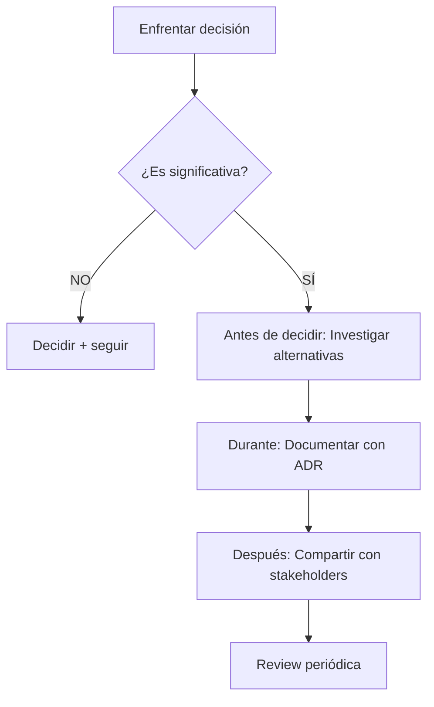

# ADR-001: Documentación de Decisiones vía ADRs

**Fecha:** 28 enero 2026  
**Estado:** ✅ Aceptada  
**Autor:** Pablo  
**Tipo:** Metodología Transversal  
**Scope:** Todos mis proyectos

---

## Resumen

En el contexto de ser Solution Architect donde valor principal es **criterio** (no velocidad de ejecución), decidí documentar todas las decisiones arquitectónicas significativas usando Architecture Decision Records (ADRs), aceptando overhead de escritura (~15 min por ADR) para ganar trazabilidad, aprendizaje y diferenciación profesional.

---

## Contexto

### Por Qué Documentar Decisiones

**Problema sin ADRs:**
```
6 meses después...
"¿Por qué elegimos PostgreSQL y no MongoDB?"
"¿Por qué self-hosted y no managed?"
"¿Quién decidió esto?"
```

**Resultado:** Decisiones se pierden, se repiten errores, no hay aprendizaje.

**Con ADRs:**
```
Lee ADR-005-eleccion-base-datos.md
"Ah, consideraron MongoDB pero..."
"Trade-off documentado"
"Aprendizaje preservado"
```

---

## Decisión

**Usaré ADRs para documentar:**

### 1. Decisiones Arquitectónicas Significativas

**Qué cuenta como "significativa":**
- ✅ Afecta múltiples componentes
- ✅ Difícil o costosa de revertir (Type 1 decision)
- ✅ Tiene trade-offs importantes
- ✅ Alguien preguntará "¿por qué?" en 6 meses

**Ejemplos:**
- Elección de base de datos
- Self-hosted vs managed
- Monolith vs microservices
- Vendor selection

### 2. Políticas Transversales

**Ejemplos:**
- Compliance policies
- Security standards
- Testing strategies
- Deployment practices

### NO uso ADRs para:
- ❌ Decisiones triviales reversibles
- ❌ Preferencias personales sin impacto
- ❌ Elecciones obvias sin alternativas
- ❌ Código implementation details

---

## Estructura de ADRs

### Template Detallado (Decisiones Estratégicas)

Uso para: Decisiones Type 1, alto impacto, múltiples alternativas

**Secciones obligatorias:**
1. Resumen Ejecutivo
2. Contexto
3. Alternativas Consideradas (mínimo 2)
4. Decisión
5. Consecuencias (positivas + negativas)
6. Trade-offs

**Ejemplo:** Elección de stack tecnológico completo

### Template Ligero (Decisiones Tácticas)

Uso para: Decisiones Type 2, reversibles, contexto claro

**Secciones obligatorias:**
1. Contexto (breve)
2. Decisión
3. Por Qué
4. Trade-offs (si relevante)

**Ejemplo:** Naming conventions, folder structure

---

## Proceso de Creación

**Workflow:**


**Timing:**
- ADR se escribe **MIENTRAS decides**, no después
- Captura razonamiento fresco
- Documenta alternativas que NO elegiste (crítico)

---

## Numeración y Organización

### Sistema de Numeración

**En BUENAS_PRACTICAS (principios):**
```
ADR-000: Meta-principios (este)
ADR-001: Metodología transversal
ADR-002: Política general
...
```

**En proyectos específicos:**
```
project-x/ADRs/
  ADR-001-arquitectura-inicial.md
  ADR-002-eleccion-base-datos.md
  ...
```

**Numeración separada** → Evita confusión entre principios y aplicaciones

---

## Estados de ADRs
```
✅ Aceptada - Decisión activa actual
⚠️ Deprecada - Ya no aplica pero preservada
🚫 Rechazada - Se consideró pero no se eligió
📝 Propuesta - En discusión
⏸️ Superseded - Reemplazada por ADR-XXX
```

---

## Alternativas Consideradas

### Alternativa A: No Documentar (Solo Código)

**Pros:**
- ✅ Más rápido short-term
- ✅ Sin overhead

**Contras:**
- ❌ Conocimiento se pierde
- ❌ Errores se repiten
- ❌ Onboarding difícil
- ❌ No hay aprendizaje sistematizado

**Por qué NO:** Mi valor como arquitecto ES el criterio. Sin documentation, ese valor desaparece.

---

### Alternativa B: Wiki/Confluence

**Pros:**
- ✅ Interfaz amigable
- ✅ Buscar fácil

**Contras:**
- ❌ Separado del código
- ❌ Desactualizado fácilmente
- ❌ Requiere login/permissions
- ❌ No version-controlled

**Por qué NO:** ADRs junto al código = single source of truth

---

### Alternativa C: ADRs (ELEGIDA)

**Pros:**
- ✅ Version-controlled (Git)
- ✅ Junto al código
- ✅ Markdown simple
- ✅ Portable
- ✅ Estándar industry

**Contras:**
- ❌ Overhead ~15 min por ADR
- ❌ Requiere disciplina

---

## Consecuencias

### Positivas ✅

1. **Aprendizaje Sistematizado**
   - Cada decisión documentada es lección aprendida
   - Portfolio de criterio arquitectónico

2. **Trazabilidad**
   - 6 meses después sé por qué decidí X
   - Puedo defender decisiones

3. **Diferenciación Profesional**
   - En entrevistas: "Aquí están mis decisiones documentadas"
   - En ventas: "Así trabajo, con transparencia"

4. **Onboarding Rápido**
   - Nuevo dev lee ADRs → entiende contexto
   - Evita preguntas repetitivas

### Negativas ⚠️

1. **Time Overhead**
   - ~15-30 min por ADR significativo
   - Puede sentirse burocracia

2. **Tentación de Sobre-documentar**
   - Riesgo: ADR por cada cosa trivial
   - Mitigación: Criterio de "significancia"

---

## Métricas de Éxito

**Corto plazo (3 meses):**
- ✅ 5+ ADRs escritos
- ✅ Ningún proyecto sin ADRs
- ✅ ADRs ayudan en debugging ("por qué elegimos X")

**Medio plazo (6 meses):**
- ✅ ADRs citados en conversaciones clientes
- ✅ Portfolio incluye ADRs como diferenciador
- ✅ ADRs evitaron repetir error

**Largo plazo (12+ meses):**
- ✅ Otros devs usan mis ADRs como referencia
- ✅ ADRs parte natural de workflow (no esfuerzo)

---

## Referencias

- **ADR-000:** Principios fundamentales (ADRs implementan principio documentación)
- **Templates:** ADR_TEMPLATE_DETALLADO.md, ADR_TEMPLATE_LIGERO.md
- **Ejemplos:** /learning-journey/ADRs/ (mis ADRs de aprendizaje)

---

**Firmado:** Pablo  
**Revisión próxima:** Al completar 10 ADRs (aprox mes 4-5)

*"Decisiones no documentadas = Decisiones perdidas"*